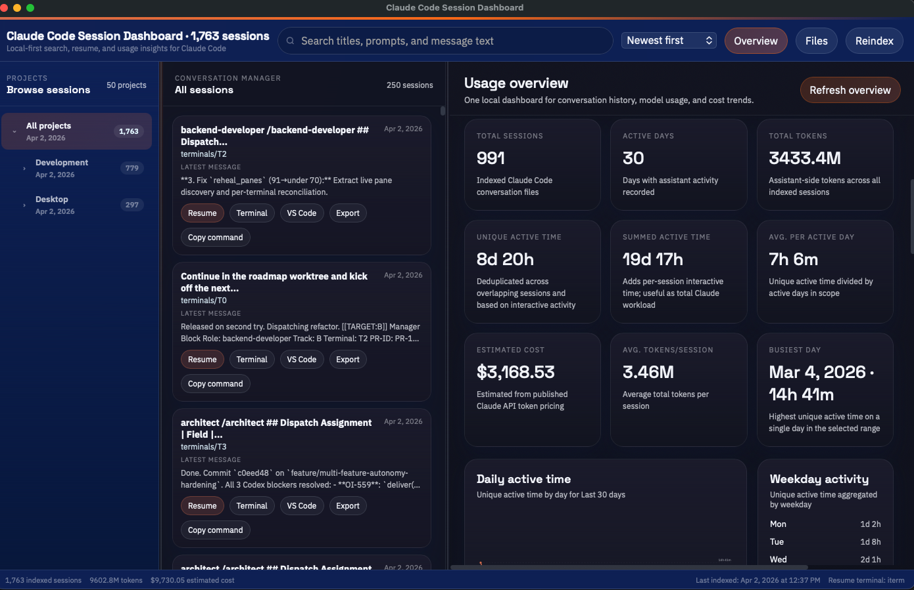
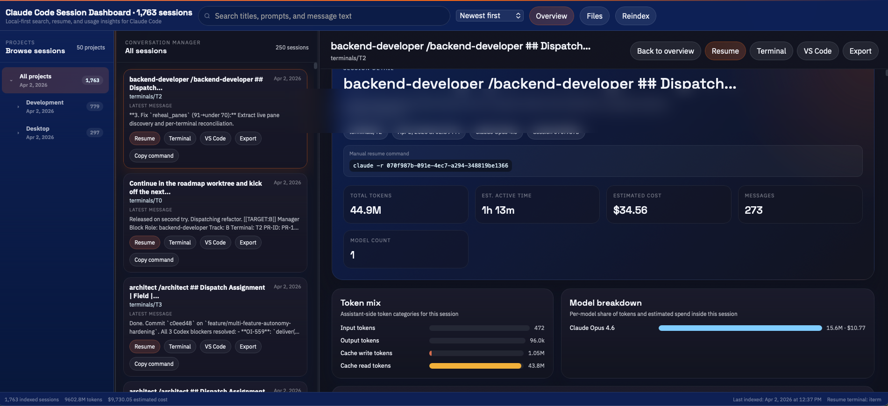

# Claude Code Session Dashboard

Browse, search, resume, and analyze your Claude Code sessions locally.

Claude Code stores session history as JSONL files in `~/.claude/projects/`. This app turns that local history into a searchable SQLite index and a desktop dashboard for finding conversations, reopening work, and understanding token usage, model usage, cost estimates, and activity over time.

- Claude Code only
- Local-first
- No cloud backend
- No account
- No telemetry upload

## Why use it

- Find old Claude Code sessions fast
- See the latest activity first
- Preview transcripts before reopening them
- Resume a session with `claude -r <session-id>`
- Understand token usage, estimated cost, model mix, and active time
- Keep everything on your machine

## Screenshots




## Quick start

### Option 1: package install (recommended)

```bash
uv tool install claude-session-dashboard
claude-session-dashboard-init
claude-session-dashboard
```

or:

```bash
pipx install claude-session-dashboard
claude-session-dashboard-init
claude-session-dashboard
```

### Option 2: plug-and-play install (repo)

```bash
git clone https://github.com/Vinix24/claude-conversation-manager.git
cd claude-conversation-manager
./install.sh
./run.sh
```

`install.sh` will:

1. Create a local virtual environment
2. Install the app and its dependencies
3. Build the initial SQLite index from `~/.claude/projects/`
4. Create convenience commands in `~/.local/bin/`
5. On macOS, install a `launchd` job that reindexes every 30 minutes and on file changes

If `~/.claude/projects/` does not exist yet, install still succeeds. The app opens with an empty state and you can reindex later after Claude Code has created local session files.

## What the app includes

### Conversation manager

- Search sessions across projects
- Browse sessions in a folder tree
- Sort by newest first or oldest first
- Open a transcript preview with markdown rendering
- Resume in Terminal, iTerm, Warp, or by copying the manual command
- Export a session as Markdown or JSON

### Usage dashboard

- Total tokens
- Estimated total cost
- Total sessions
- Active days
- Unique active time and summed active time
- Average active time per active day
- Top models used
- Daily tokens
- Daily cost estimate
- Daily active time
- Model usage over time
- Session size distribution
- Weekday and hour usage patterns
- Heaviest sessions table

## Default data source

By default the app reads Claude Code sessions from:

```bash
~/.claude/projects/
```

That matches the standard Claude Code location. You only need to change it if you intentionally store Claude Code data somewhere else.

If the folder does not exist yet, the dashboard still launches. You will just see an empty state until Claude Code has written session history locally.

## Running the app

After installing, you can run:

```bash
claude-session-dashboard
```

If you installed via repo and prefer the script:

```bash
./run.sh
```

Manual reindex:

```bash
claude-session-index
```

Force a full rebuild:

```bash
claude-session-index --force
```

## Configuration

Configuration is stored at:

```bash
~/.config/claude-session-dashboard/config.yaml
```

Example:

```yaml
claude_projects_dir: ~/.claude/projects
project_filters:
skip_subdirs: scheduled_jobs, subagents
file_browser_root:
terminal: auto
window_width: 1560
window_height: 980
```

Notes:

- `claude_projects_dir`: override the default Claude Code sessions location
- `project_filters`: optional folder-name filters if you only want a subset of projects indexed
- `skip_subdirs`: folder names to ignore while scanning
- `file_browser_root`: optional root for the built-in file browser panel
- `terminal`: `auto`, `terminal`, `iterm`, `warp`, `vscode`, `system`, or `windows`
- `custom_css_path`: optional custom CSS file to override branding colors and styles

Legacy config at `~/.config/claude-conversation-manager/config.yaml` is still read automatically if it already exists.

## Branding overrides

Add a custom CSS file and point to it in config:

```yaml
custom_css_path: ~/.config/claude-session-dashboard/custom.css
```

That file is injected after the built-in styles, so your colors and typography override the defaults. The simplest way to rebrand is to override the CSS variables in the `:root` block.

## Estimated cost

Estimated cost is clearly labeled as an estimate.

- It is derived from recorded Claude model usage in your local session files
- It uses published Claude API token pricing for recognized models
- Unknown or synthetic model identifiers are excluded from the pricing estimate and tracked as uncovered tokens

The dashboard shows pricing coverage so you can judge how complete the estimate is for your local history.

## Usage metadata

This app does not require a separate token or cost tracking package.

- Claude Code session files already include usage metadata in current transcript formats
- The dashboard reads that local metadata directly from the JSONL files
- `/statusline` scripts can be useful for live terminal display, but they are not required for historical indexing or the dashboard

## Privacy

Runtime data stays out of the repo by default:

- Indexed database lives in `~/.claude/conversation-index.db`
- Config lives in `~/.config/claude-session-dashboard/config.yaml`
- Shell shortcuts live in `~/.local/bin/`
- macOS auto-indexer plist lives in `~/Library/LaunchAgents/`
- Local repo-only artifacts like `.venv/` are gitignored

This app reads your local Claude Code history. It does not upload it anywhere.

## Requirements

- Python 3.10+
- Claude Code installed and in use
- A populated `~/.claude/projects/` directory for full results
- macOS for built-in `launchd` auto-indexing and native AppleScript terminal integration
- Windows works for browsing and dashboard usage; resume-in-terminal uses Windows Terminal or PowerShell when available

Linux browsing and dashboard usage work as well. Resume-in-terminal includes a Linux fallback for common terminal launchers, but the polished install path is still macOS-first today.

## Architecture

```text
~/.claude/projects/               Claude Code JSONL session files
        |
   indexer.py                     Parses JSONL -> SQLite
        |
~/.claude/conversation-index.db   Search + analytics database
        |
   app.py + pywebview             Desktop app
        |
   templates/index.html           Dashboard and conversation manager UI
```

Main modules:

- `indexer.py`: indexing, schema migration, and usage metadata extraction
- `claude_models.py`: model normalization and pricing estimates
- `dashboard_data.py`: normalized dashboard and detail payloads
- `app.py`: desktop API for the frontend
- `templates/index.html`: single-file UI

## Troubleshooting

### I installed it but I see no sessions

Make sure Claude Code has already written local transcripts to `~/.claude/projects/`. If needed, run:

```bash
claude-session-index --force
```

### Do I need a separate token tracking package?

No. Current Claude Code transcript formats already include usage metadata in the JSONL files.

### Can I resume manually without the UI buttons?

Yes:

```bash
claude -r <session-id>
```

## License

MIT
